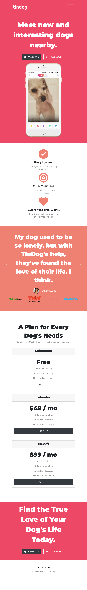
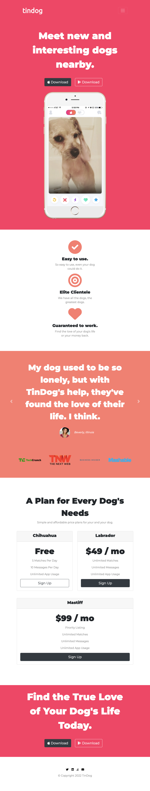
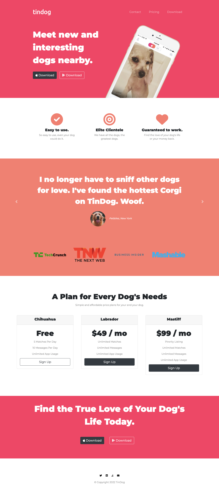

# TinDog

- With TinDog, find the True Love of Your Dog's Life Today!

## Table of contents

- [Overview](#overview)
    - [Screenshot](#screenshot)
    - [Links](#links)
- [My process](#my-process)
    - [Built with](#built-with)
    - [What I learned](#what-i-learned)
    - [Continued development](#continued-development)
- [Author](#author)
- [Acknowledgments](#acknowledgments)


## Overview

### Screenshot

- Mobile Viewport:


- Tablet Viewport:


- Desktop Viewport:



### Links

- Live Site URL: [TinDog](https://yashviradia.github.io/TinDog/)

## My process

### Built with

- Semantic HTML5 markup
- CSS custom properties
- Flexbox
- CSS Grid
- Bootstrap 4.1.3

### What I learned

- Wireframing
- CSS Grid Layout system
- Bootstrap Containers
- Bootstrap Carousel
- Bootstrap Cards
- CSS Z-Index
- Media Query Breakpoints
  - ```css
    @media (max-width: 1028px) {
       .title-image {
         position: static;
         transform: rotate(0);
       }

       #title {
         text-align: center;
       }
    }
    ```


### Continued development

- Turn this single page website into a website with multiple pages.


## Author

- Website - [Yash Viradia](http://yashviradia.tech/)
- Twitter - [theyashviradia](https://twitter.com/theyashviradia)

## Acknowledgments

- Project Idea - [LondonAppBrewery](https://www.londonappbrewery.com/)
- Icons - [FontAwesome](https://fontawesome.com/)
